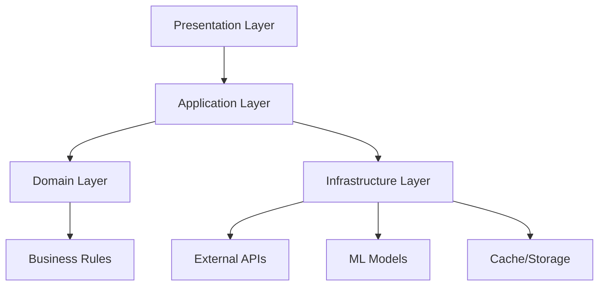

# 🏛️ Arquitetura do Sistema

## Visão Geral

O projeto segue **Clean Architecture** organizada por **features**, garantindo separação de responsabilidades e alta testabilidade.

## 🏗️ Estrutura Geral

```
projeto_alerta_cheias/
├── app/                          # Aplicação principal
│   ├── core/                     # Núcleo compartilhado
│   ├── features/                 # Features organizadas por domínio
│   └── main.py                   # Ponto de entrada FastAPI
├── data/                         # Dados do projeto
├── notebooks/                    # Análise e experimentação
├── scripts/                      # Scripts utilitários
├── tests/                        # Testes automatizados
├── docker/                       # Configurações Docker
└── requirements/                 # Dependências por ambiente
```

## 🔧 Core Module

### Responsabilidades

- Configurações globais e settings
- Exceções customizadas do sistema
- Injeção de dependências
- Logging estruturado
- Utilities compartilhadas

### Estrutura

```
app/core/
├── __init__.py
├── config.py              # Settings com Pydantic
├── exceptions.py          # Exceções customizadas
├── dependencies.py        # Injeção de dependências FastAPI
├── logging.py             # Configuração de logs estruturados
└── utils.py               # Utilities compartilhadas
```

### Configurações (config.py)

```python
from pydantic_settings import BaseSettings
from typing import Optional

class Settings(BaseSettings):
    # API Configuration
    API_HOST: str = "0.0.0.0"
    API_PORT: int = 8000
    API_RELOAD: bool = False

    # External APIs
    OPENMETEO_BASE_URL: str = "https://api.open-meteo.com/v1"
    GUAIBA_API_URL: str = "https://nivelguaiba.com.br/portoalegre.1day.json"

    # Cache Configuration
    REDIS_URL: Optional[str] = None
    CACHE_TTL_WEATHER: int = 3600      # 1 hora
    CACHE_TTL_GUAIBA: int = 1800       # 30 minutos

    # Model Configuration
    MODEL_PATH: str = "data/modelos_treinados/"
    MODEL_VERSION: str = "hybrid_v2.1"

    # Logging
    LOG_LEVEL: str = "INFO"
    LOG_FORMAT: str = "json"

    class Config:
        env_file = ".env"
        case_sensitive = True

def get_settings() -> Settings:
    return Settings()
```

## 🎯 Features Architecture

### Clean Architecture por Feature

Cada feature segue o padrão de **Clean Architecture** com 4 camadas:

```
features/<feature_name>/
├── domain/                # Camada de Domínio
├── application/           # Camada de Aplicação
├── infra/                 # Camada de Infraestrutura
└── presentation/          # Camada de Apresentação
```

### Feature: Forecast (Previsão)

```
features/forecast/
├── domain/
│   ├── entities.py        # WeatherData, Forecast, ModelMetrics
│   ├── services.py        # ForecastService, WeatherAnalysisService
│   └── repositories.py    # Interfaces abstratas
├── application/
│   └── usecases.py        # GenerateForecastUseCase, GetModelMetricsUseCase
├── infra/
│   ├── model_loader.py    # Carregamento modelos TensorFlow
│   ├── forecast_model.py  # Wrapper do modelo LSTM
│   └── data_processor.py  # Preprocessamento de dados
└── presentation/
    ├── routes.py          # Endpoints FastAPI
    └── schemas.py         # DTOs Pydantic
```

### Feature: Alerts (Alertas)

```
features/alerts/
├── domain/
│   ├── entities.py        # Alert, AlertLevel, RiverLevel
│   ├── alert_rules.py     # Matriz de classificação
│   └── services.py        # AlertService, RiskCalculationService
├── application/
│   └── usecases.py        # GenerateAlertUseCase, GetCurrentConditionsUseCase
├── infra/
│   ├── external_api.py    # Clients Open-Meteo e Guaíba
│   └── cache.py           # Implementação cache Redis
└── presentation/
    ├── routes.py          # Endpoints de alertas
    └── schemas.py         # DTOs de alertas
```

## 🔄 Fluxo de Dados

### Clean Architecture Flow



### Request Flow Example

1. **Presentation**: `POST /forecast/predict` recebe request
2. **Application**: `GenerateForecastUseCase` coordena operação
3. **Domain**: `ForecastService` aplica regras de negócio
4. **Infrastructure**:
   - `ModelLoader` carrega modelo LSTM
   - `DataProcessor` preprocessa dados
   - `ExternalAPI` busca dados atuais
5. **Domain**: Validação do resultado
6. **Presentation**: Retorna response formatado

## 🔌 Dependency Injection

### Container de Dependências

```python
# app/core/dependencies.py
from functools import lru_cache
from fastapi import Depends

# Singleton Settings
@lru_cache()
def get_settings() -> Settings:
    return Settings()

# Repository Dependencies
def get_weather_repository() -> WeatherRepository:
    return WeatherRepositoryImpl()

def get_model_repository() -> ModelRepository:
    return ModelRepositoryImpl()

def get_cache_repository() -> CacheRepository:
    settings = get_settings()
    if settings.REDIS_URL:
        return RedisCacheRepository(settings.REDIS_URL)
    return MemoryCacheRepository()

# Service Dependencies
def get_forecast_service(
    weather_repo: WeatherRepository = Depends(get_weather_repository),
    model_repo: ModelRepository = Depends(get_model_repository)
) -> ForecastService:
    return ForecastService(weather_repo, model_repo)

# UseCase Dependencies
def get_forecast_usecase(
    forecast_service: ForecastService = Depends(get_forecast_service),
    cache_repo: CacheRepository = Depends(get_cache_repository)
) -> GenerateForecastUseCase:
    return GenerateForecastUseCase(forecast_service, cache_repo)
```

### Uso nos Endpoints

```python
# features/forecast/presentation/routes.py
from fastapi import APIRouter, Depends
from app.core.dependencies import get_forecast_usecase

router = APIRouter()

@router.post("/predict")
async def generate_forecast(
    request: ForecastRequest,
    usecase: GenerateForecastUseCase = Depends(get_forecast_usecase)
):
    return await usecase.execute(request)
```

## 🧪 Testabilidade

### Mocks e Test Doubles

```python
# tests/unit/forecast/test_domain.py
import pytest
from unittest.mock import Mock

def test_forecast_service_generate_prediction():
    # Arrange
    mock_weather_repo = Mock(spec=WeatherRepository)
    mock_model_repo = Mock(spec=ModelRepository)

    mock_weather_repo.get_latest_data.return_value = create_weather_data()
    mock_model_repo.load_model.return_value = create_mock_model()

    service = ForecastService(mock_weather_repo, mock_model_repo)

    # Act
    result = service.generate_prediction(hours_ahead=24)

    # Assert
    assert result.confidence > 0.8
    assert result.precipitation_24h >= 0
    mock_weather_repo.get_latest_data.assert_called_once()
```

### Integration Tests

```python
# tests/integration/test_forecast_api.py
import pytest
from fastapi.testclient import TestClient

def test_forecast_endpoint_integration():
    with TestClient(app) as client:
        response = client.post("/forecast/predict", json={
            "hours_ahead": 24,
            "include_atmospheric": True
        })

        assert response.status_code == 200
        data = response.json()
        assert "forecast" in data
        assert "confidence" in data
        assert data["confidence"] > 0.0
```

## 📊 Error Handling

### Exception Hierarchy

```python
# app/core/exceptions.py
class AppException(Exception):
    """Base exception for the application"""
    def __init__(self, message: str, error_code: str = None):
        self.message = message
        self.error_code = error_code
        super().__init__(message)

class DomainException(AppException):
    """Domain layer exceptions"""
    pass

class InfrastructureException(AppException):
    """Infrastructure layer exceptions"""
    pass

class ExternalAPIException(InfrastructureException):
    """External API related exceptions"""
    pass

class ModelException(InfrastructureException):
    """ML Model related exceptions"""
    pass

# Specific exceptions
class InvalidWeatherDataException(DomainException):
    pass

class ModelNotLoadedException(ModelException):
    pass

class OpenMeteoAPIException(ExternalAPIException):
    pass
```

### Global Error Handler

```python
# app/main.py
from fastapi import FastAPI, Request
from fastapi.responses import JSONResponse

app = FastAPI()

@app.exception_handler(DomainException)
async def domain_exception_handler(request: Request, exc: DomainException):
    return JSONResponse(
        status_code=400,
        content={
            "error": "Domain Error",
            "message": exc.message,
            "error_code": exc.error_code
        }
    )

@app.exception_handler(ExternalAPIException)
async def api_exception_handler(request: Request, exc: ExternalAPIException):
    return JSONResponse(
        status_code=503,
        content={
            "error": "External Service Unavailable",
            "message": exc.message,
            "error_code": exc.error_code
        }
    )
```

## 🔍 Monitoring e Observabilidade

### Structured Logging

```python
# app/core/logging.py
import logging
import json
from typing import Dict, Any

class JSONFormatter(logging.Formatter):
    def format(self, record: logging.LogRecord) -> str:
        log_entry = {
            "timestamp": self.formatTime(record),
            "level": record.levelname,
            "logger": record.name,
            "message": record.getMessage(),
            "module": record.module,
            "line": record.lineno
        }

        # Add extra fields
        if hasattr(record, 'request_id'):
            log_entry['request_id'] = record.request_id

        if hasattr(record, 'user_id'):
            log_entry['user_id'] = record.user_id

        return json.dumps(log_entry)

def setup_logging():
    handler = logging.StreamHandler()
    handler.setFormatter(JSONFormatter())

    logger = logging.getLogger()
    logger.addHandler(handler)
    logger.setLevel(logging.INFO)
```

### Metrics Collection

```python
# app/core/metrics.py
from typing import Dict, Any
from datetime import datetime

class MetricsCollector:
    def __init__(self):
        self.metrics = {}

    def increment_counter(self, metric_name: str, tags: Dict[str, str] = None):
        """Increment a counter metric"""
        pass

    def record_timing(self, metric_name: str, duration_ms: float, tags: Dict[str, str] = None):
        """Record timing metric"""
        pass

    def record_gauge(self, metric_name: str, value: float, tags: Dict[str, str] = None):
        """Record gauge metric"""
        pass

# Usage in services
metrics = MetricsCollector()

class ForecastService:
    def generate_prediction(self, hours_ahead: int):
        start_time = datetime.now()

        try:
            result = self._do_prediction(hours_ahead)

            metrics.increment_counter("forecast.prediction.success")
            metrics.record_gauge("forecast.confidence", result.confidence)

            return result
        except Exception as e:
            metrics.increment_counter("forecast.prediction.error",
                                    tags={"error_type": type(e).__name__})
            raise
        finally:
            duration = (datetime.now() - start_time).total_seconds() * 1000
            metrics.record_timing("forecast.prediction.duration", duration)
```

## 🔧 Configuration Management

### Environment-based Configuration

```python
# Desenvolvimento (.env.dev)
API_RELOAD=true
LOG_LEVEL=DEBUG
REDIS_URL=redis://localhost:6379

# Produção (.env.prod)
API_RELOAD=false
LOG_LEVEL=INFO
REDIS_URL=redis://prod-redis:6379
```

### Feature Flags

```python
class FeatureFlags:
    ENABLE_ATMOSPHERIC_ANALYSIS: bool = True
    ENABLE_REAL_TIME_VALIDATION: bool = False
    USE_ENSEMBLE_MODEL: bool = True
    ENABLE_DETAILED_LOGGING: bool = False

def get_feature_flags() -> FeatureFlags:
    return FeatureFlags()
```

## 🎯 Benefits da Arquitetura

### ✅ Vantagens

- **Separation of Concerns**: Cada camada tem responsabilidade única
- **Testability**: Fácil criação de unit tests e mocks
- **Flexibility**: Mudanças em infraestrutura não afetam domínio
- **Scalability**: Features independentes podem escalar separadamente
- **Maintainability**: Código organizado e bem estruturado

### 🔄 Trade-offs

- **Complexity**: Mais arquivos e abstrações
- **Learning Curve**: Requer conhecimento do padrão
- **Over-engineering**: Pode ser excessivo para projetos pequenos

A arquitetura Clean por features garante um código **maintível**, **testável** e **escalável** para o sistema de alertas de cheias.
